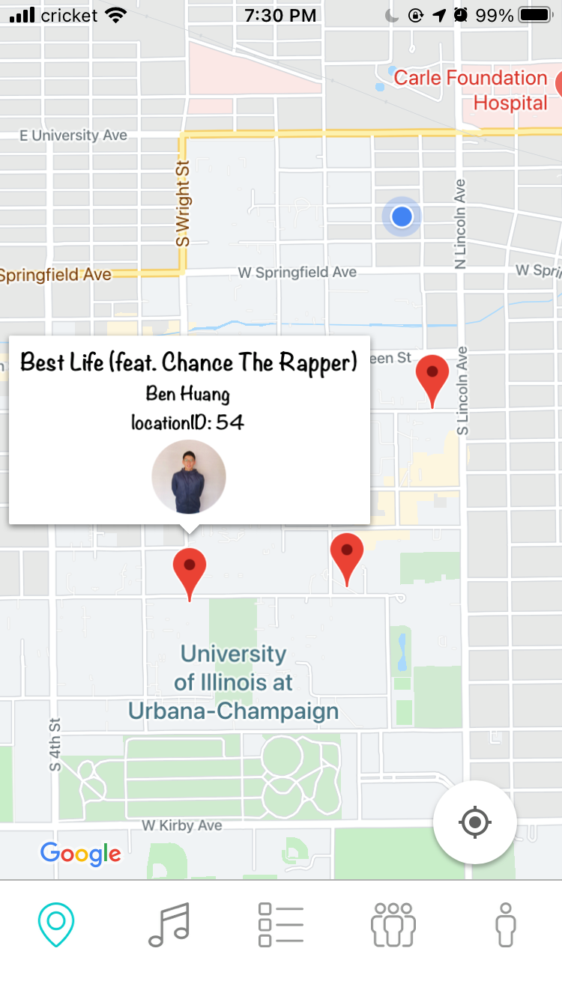
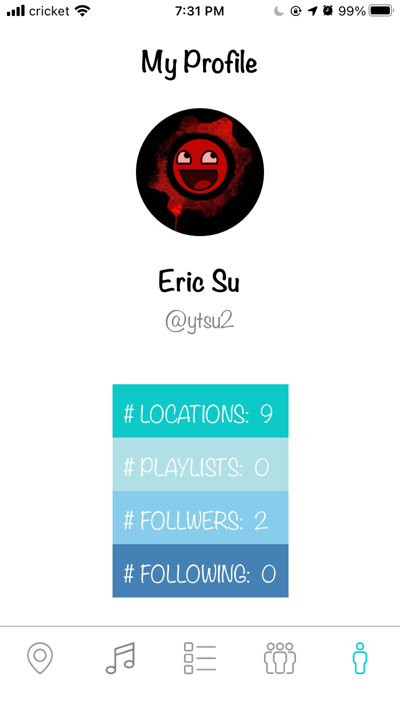

# GrooveMap
By Ben, Eric, Manik, and Richard

This repo contains our final project for the database systems course.

Link to YouTube [demo](https://youtu.be/TByy7S5CvWA).

### What we have accomplished
Our mobile app is a music sharing platform that allows users to share where they are when
listening to a certain song. Users can add friends and view where they are when listening to
music, along with having the ability to create custom playlists of all songs listened to in a certain
area.

  

### The problem
A large factor in determining what music an individual listens to is based on where they are and
what they are doing. For example, someone will listen to different music when they are in the
gym working out or when they are in the library studying. There currently doesn’t exist a social
media platform that combines location sharing and music sharing. Our platform solves this
problem by allowing users to share what specific song they listen to at a certain location.

### Data in our database
To make this application possible we need to store a variety of things including track name,
location information, etc. In our SQL database, we decided to store all of the information related
to track information, album information, location information, user information, and artist
information. This data is used for the core features of our application, including adding a song to
a location on the mapScreen, following another user, clicking on a specific track and listening to
it in Spotify, etc. On the other hand, we store playlist information in the NoSQL database for
better performance.

### Data Collection
For user data, we created a signup feature in our application and asked some friends to create
user accounts. For real-world data, we wrote Python programs to extract track information,
album information, and artist information from Spotify using its API and inserted the collected
data into our SQL database. Here is a link to the [Spotify Scraper](https://github.com/weichen6626/SpotifyScraper/).
